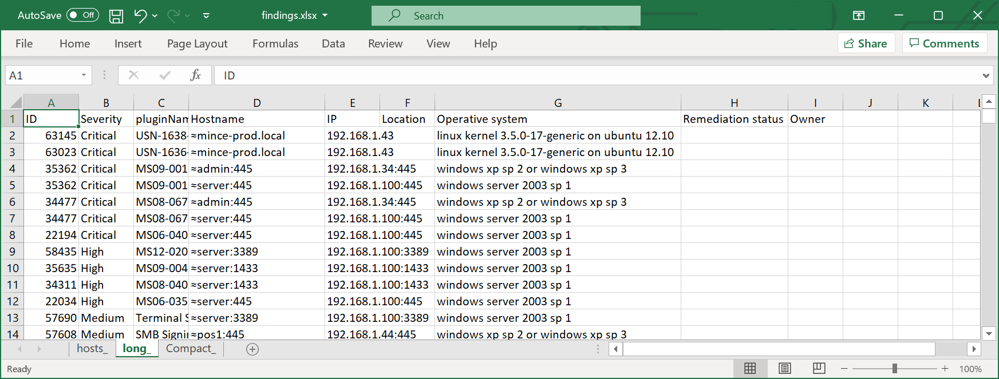

# The Nessus Butcher - enterprise vulnerability management 

### Visualise data from multiple nessus reports simultaneously, filter data, and output on terminal, as text, html or excel / xlsx


### Feature list and improvements over vanilla nessus reports:
* [Visualise data from multiple .nessus scan files simultaneously](#read-data-from-multiple-nessus-scan-files)
* [Improved hostname/address enumeration that](#improved-hostnames-and-address-enumeration): 
  * [Show correct hostnames that actually resolve to the relevant IP address](#routable-hostnames)
  * [Brute force potential DNS name combination found in scan data in search for a resolvable match](#address-brute-force)
  * [Actively scan Windows RDP certificates for hostnames as last resort](#windows-rdp-certificates-name)
  * [Remove unneeded domain suffix to shorten hostnames](#shorten-hostnames)
  * Make an educated guess when no other hostname matching name can be found 
  * [DNS cache - automaical load/save resolved DNS names found](#lookups-cache)
  * [Saved Excel report can also be used as a cache for future runs](#excel-cache)
* [Improved OS detection](#improved-os-detection) - use authenticated more reliable data when available, that for example shows build and version numbers for Windows 10, 2016, 2019  
* Tagging hosts with __"location"__ data for matching hosts or IP-ranges,  multiple ranges can be matched, such as `10.0.0.0/20 Paris` and `10.0.1.0/24 Office wifi` will tag 10.0.0.1 with `Paris, Office wifi`
* [Many filter options](#filter-options): 
  * [hosts filters that automatically understand different formats](#filter-option-hosts), such as IP addresses (IPv4) like 192.168.1.1, IPv4 address ranges like 192.168.1.0/24 or hostnames
  * Text or Excel lists with filters to include or exclude can be used
  * basic filtering like severity, [nessus finding ID](#option-id), or [maching](#option-match) strings or plugin_name 
* Different views when visualising data in the terminal as text: 
  * [Hosts with finding statistics only](#host-style---the-default-output), this is default or --style host
  * [Hosts and each finding](#long-style---one-line-per-host-per-finding), this is --style long  
  * [Finding with a list of affected hosts](#compact-style---one-line-per-findingvulnerability), this is --style compact 
* [Excel output](#excel-output), either with hosts overview or finding details 
* [HTML output](#html-output), the default `mustache` template can easily be changed to for example include your organisations logo 
* [Terminal / command line `grep` friendly output with ip:port and hostname on each line](#format-grep)
* [Prerequisites and package requirements](#prerequisites-and-package-requirements)
* Last the [--help page](#the-butcher---help-page): 

## Read data from multiple .nessus scan files 
#### Host style - the default output 
There are some public nessus scan files in the `examples/` folder that can be used for testing.  
The data from 4 different nessus scans are combined, and the result is listed per host:
```
 python3 butcher.py  examples/*.nessus
 Critical High Medium Low None        Addr             IP                      Operative-System                            hostname-probability
    0      0     0     0   8     ≈orkun-2.local   192.168.1.57                    unknown-os                  Guess: unresolved nessus-fqdn, suffix mismatch
    0      0     2     0   19        ≈pos1        192.168.1.44        windows xp sp 2 or windows xp sp 3             Guess: unresolved nessus-netbios
    2      0     4     0   61  ≈mince-prod.local  192.168.1.43  linux kernel 3.5.0-17-generic on ubuntu 12.10 Guess: unresolved nessus-fqdn, suffix mismatch
    0      0     0     0   4                      192.168.1.38                    unknown-os                                     Failure
    2      0     2     0   23        ≈admin       192.168.1.34        windows xp sp 2 or windows xp sp 3             Guess: unresolved nessus-netbios
    0      0     2     0   20        ≈xp-pc       192.168.1.33        windows xp sp 2 or windows xp sp 3             Guess: unresolved nessus-netbios
    0      0     0     0   17                    192.168.1.203                    unknown-os                                     Failure
    0      0     0     0   17                    192.168.1.202                    unknown-os                                     Failure
    0      0     0     0   17                    192.168.1.201                    unknown-os                                     Failure
    3      4     4     1   28       ≈server      192.168.1.100             windows server 2003 sp 1                  Guess: unresolved nessus-netbios
    0      0     1     4   23                     192.168.1.1          catalystos 1900 or nortel switch                          Failure
    5      3     20    7  113   ≈metasploitable   192.168.0.7      linux kernel 2.6 on ubuntu 8.04 (gutsy)           Guess: unresolved nessus-netbios
    0      0     4     1   38      ≈qa3app09      10.31.112.29       windows server 2008 r2 standard sp 1            Guess: unresolved nessus-netbios
    0      0     3     1   37      ≈qa3app06      10.31.112.26       windows server 2008 r2 standard sp 1            Guess: unresolved nessus-netbios
    0      0     3     1   37      ≈qa3app05      10.31.112.25       windows server 2008 r2 standard sp 1            Guess: unresolved nessus-netbios
    0      0     3     1   37      ≈qa3app04      10.31.112.24       windows server 2008 r2 standard sp 1            Guess: unresolved nessus-netbios
    0      0     3     1   37      ≈qa3app03      10.31.112.23       windows server 2008 r2 standard sp 1            Guess: unresolved nessus-netbios
    0      0     3     1   41      ≈qa3app02      10.31.112.22       windows server 2008 r2 standard sp 1            Guess: unresolved nessus-netbios
    0      0     4     1   38      ≈qa3app01      10.31.112.21       windows server 2008 r2 standard sp 1            Guess: unresolved nessus-netbios
    0      0     1     2   33    ≈www.baidu.com  115.239.210.27                     other                     Guess: unresolved nessus-fqdn, suffix mismatch
    0      0     5     3   58     ≈www.126.com   101.69.104.74                      other                     Guess: unresolved nessus-fqdn, suffix mismatch
---------------------- Summary of findings from above: -------------------------
 Critic High Medium Low None
   12    7     64    24 706
Total number of hosts:          21
Uncompliant number of hosts:    4       ( 19% )
--------------------------------------------------------------------------------
```
#### Compact style - one line per finding/vulnerability  

Option `--style compact` is used to view the output as single finding per line, with multiple instances for that finding in the address list.  
Port is always listed, as a finding can be present on multiple ports per host, for example both 80 and 443  
Options `--hosts pos1` and `--hosts admin` are added to only show data relating to those hosts.
```
 python3 butcher.py  examples/*.nessus --style compact --hosts pos1 --hosts admin
   ID  severity                                              pluginName                                               Address-list
 35362 Critical MS09-001: Microsoft Windows SMB Vulnerabilities Remote Code Execution (958687) (uncredentialed check ≈admin:445
 34477 Critical MS08-067: Microsoft Windows Server Service Crafted RPC Request Handling Remote Code Execution (95864 ≈admin:445
 57608  Medium                                          SMB Signing Disabled                                         ≈pos1:445,≈admin:445
 26920  Medium                           Microsoft Windows SMB NULL Session Authentication                           ≈pos1:445,≈admin:445
 54615   None                                               Device Type                                              ≈pos1,≈admin
 45590   None                                    Common Platform Enumeration (CPE)                                   ≈pos1,≈pos1
 35716   None                                   Ethernet Card Manufacturer Detection                                 ≈pos1,≈admin
 26917   None                Microsoft Windows SMB Registry : Nessus Cannot Access the Windows Registry              ≈pos1:445,≈admin:445
 25220   None                                       TCP/IP Timestamps Supported                                      ≈pos1,≈admin
 24786   None                         Nessus Windows Scan Not Performed with Admin Privileges                        ≈pos1,≈admin
 22964   None                                            Service Detection                                           ≈admin:21
 19506   None                                         Nessus Scan Information                                        ≈pos1,≈pos1
 11936   None                                            OS Identification                                           ≈pos1,≈admin
 11219   None                                            Nessus SYN scanner                                          ≈pos1:445,≈pos1:135,≈pos1:139,≈admin:445,≈admin:21,≈admin:135,≈admin:139
 11011   None                                 Microsoft Windows SMB Service Detection                                ≈pos1:139,≈pos1:445,≈admin:139,≈admin:445
 10884   None                               Network Time Protocol (NTP) Server Detection                             ≈pos1:123,≈admin:123
 10785   None               Microsoft Windows SMB NativeLanManager Remote System Information Disclosure              ≈pos1:445,≈admin:445
 10397   None                       Microsoft Windows SMB LanMan Pipe Server Listing Disclosure                      ≈admin:445
 10394   None                                  Microsoft Windows SMB Log In Possible                                 ≈pos1:445,≈admin:445
 10287   None                                          Traceroute Information                                        ≈pos1,≈admin
 10150   None                         Windows NetBIOS / SMB Remote Host Information Disclosure                       ≈pos1:137,≈admin:137
 10114   None                              ICMP Timestamp Request Remote Date Disclosure                             ≈pos1,≈admin
 10092   None                                           FTP Server Detection                                         ≈admin:21
```

#### Long style - one line per host per finding

This view is used to zoom in on a group of targets, to see detailed findinds per host

Option `--style long` is used to see all finding for these hosts  
Option `--min-severity medium` is used to filter out Low and None severity findings.
```
 python3 butcher.py  examples/*.nessus --style long --hosts admin --hosts pos1 --min-severity medium
   ID  severity                        pluginName                        hostname         IP                 Operative-System
 35362 Critical MS09-001: Microsoft Windows SMB Vulnerabilities Remote  ≈admin:445 192.168.1.34:445 windows xp sp 2 or windows xp sp 3
 34477 Critical MS08-067: Microsoft Windows Server Service Crafted RPC  ≈admin:445 192.168.1.34:445 windows xp sp 2 or windows xp sp 3
 57608  Medium                    SMB Signing Disabled                  ≈pos1:445  192.168.1.44:445 windows xp sp 2 or windows xp sp 3
 57608  Medium                    SMB Signing Disabled                  ≈admin:445 192.168.1.34:445 windows xp sp 2 or windows xp sp 3
 26920  Medium     Microsoft Windows SMB NULL Session Authentication    ≈pos1:445  192.168.1.44:445 windows xp sp 2 or windows xp sp 3
 26920  Medium     Microsoft Windows SMB NULL Session Authentication    ≈admin:445 192.168.1.34:445 windows xp sp 2 or windows xp sp 3
```

## Improved hostnames and address enumeration 
Nessus typically scans as per IP range, and the hostname listed in the report is often wrong or missing, for example it may be the computers' configured hostname instead of a routable address. 
I prefer routable addresses since most enterprise IT departments don't know thousands of servers IP addresses by heart.  
  
Improved hostnames and address enumeration is unlocked by with `--lookups` . Once run, the result will be cached.  

### Routable hostnames 

The hostname shown is, when possible, routable meaning a DNS name actually pointing to the relevant IP address. Brute-force is used to enumerate a correct name, with input from a number of sources in the nessus scan data. 
Failing to get find a routable name is indicated with a ≈ sign at each hostname. The `hostname-probability` column will show what hostname that was used instead of a routable one. 

The example scan used below is old, and both websites has since changed IP address used, hence the script failing to find a correct address matching the scanned IP-address: 
```
 python3 butcher.py examples/scanTestReport.nessus --lookups 
 Critical High Medium Low None      Addr            IP       Operative-System              hostname-probability
    0      0     1     2   33  ≈www.baidu.com 115.239.210.27      other       Guess: unresolved nessus-fqdn, suffix mismatch
    0      0     5     3   58   ≈www.126.com  101.69.104.74       other       Guess: unresolved nessus-fqdn, suffix mismatch
---------------------- Summary of findings from above: -------------------------
 Critic High Medium Low None
   0     0     6     5   91
Total number of hosts:          2
Uncompliant number of hosts:    0       ( 0% )
--------------------------------------------------------------------------------
```
hostname-probability is typically either of correct, an educated guess or failed when no or useless data exists.  

#### Address brute force 
When no combination of data in nessus is correct, it will brute force potential DNS name combination found in scan data in search for a resolvable match. 

#### Windows RDP certificates name 
As a last resort, on Windows machines, with port 3389 open in the nessus scan but not the certificate, it will actively scan the Windows RDP certificates for its CN name.   
Scanning takes time when that port is dropped, and can be disabled with the option `--lookups-no-certs`.

#### Shorten hostnames
Unneeded domain suffix are shorten from hostnames, to match the current domain suffix. Make sure to set a 'search' entry to your `/ets/hosts` to use short hostnames.  

### Lookups cache 
Resolved names, i.e. scans using --lookups, are automatically cached in the butcher startup directory as json files.  
Butcher will warn when the cache is older than a week, but continue anyway. Sometimes hosts on the network has changes and the old cached data may be better than a fresh scan.  

```
 python3 butcher.py examples/scan*.nessus
Warning: No name lookup cache for scanTestReport.nessus, consider active name lookups using --lookups
 Critical High Medium Low None      Addr            IP       Operative-System              hostname-probability
    0      0     1     2   33  ≈www.baidu.com 115.239.210.27      other       Guess: unresolved nessus-fqdn, suffix mismatch
    0      0     5     3   58   ≈www.126.com  101.69.104.74       other       Guess: unresolved nessus-fqdn, suffix mismatch
---------------------- Summary of findings from above: -------------------------
 Critic High Medium Low None
   0     0     6     5   91
Total number of hosts:          2
Uncompliant number of hosts:    0       ( 0% )
--------------------------------------------------------------------------------
```
#### Excel cache 
It can also be that the hostnames are not resolvable or even routable on your current network, in which case the lookup can be saved while scaning on the correct network, saved to excel files, and later fed back in as a cache:   
Option `--format excel --output-file <xlsx-file>` to save results to an Excel file, that can be as a hostname cache
```
python3 butcher.py examples/example_scan.nessus --lookups --format excel --output-file  examples/hostname-cache-example_scan.xlsx
```
Option `--hostname-excel <xlsx-file>` to read hostnames from a previous scan 
```
 python3 butcher.py examples/example_scan.nessus --hostname-excel examples/hostname-cache-example_scan.xlsx
 Critical High Medium Low None        Addr             IP                     Operative-System                            hostname-probability
    0      0     0     0   8     orkun-2.local    192.168.1.57                   unknown-os                               Correct: nessus-fqdn
    0      0     2     0   19        ≈pos1        192.168.1.44       windows xp sp 2 or windows xp sp 3             Guess: unresolved nessus-netbios
    2      0     4     0   61  ≈mince-prod.local  192.168.1.43 linux kernel 3.5.0-17-generic on ubuntu 12.10 Guess: unresolved nessus-fqdn, suffix mismatch
    0      0     0     0   4                      192.168.1.38                   unknown-os                                     Failure
    2      0     2     0   23        ≈admin       192.168.1.34       windows xp sp 2 or windows xp sp 3             Guess: unresolved nessus-netbios
    0      0     2     0   20        ≈xp-pc       192.168.1.33       windows xp sp 2 or windows xp sp 3             Guess: unresolved nessus-netbios
    0      0     0     0   17                    192.168.1.203                   unknown-os                                     Failure
    0      0     0     0   17                    192.168.1.202                   unknown-os                                     Failure
    0      0     0     0   17                    192.168.1.201                   unknown-os                                     Failure
    3      4     4     1   28       ≈server      192.168.1.100            windows server 2003 sp 1                  Guess: unresolved nessus-netbios
    0      0     1     4   23                     192.168.1.1         catalystos 1900 or nortel switch                          Failure
---------------------- Summary of findings from above: -------------------------
 Critic High Medium Low None
   7     4     15    5  237
Total number of hosts:          11
Uncompliant number of hosts:    3       ( 27% )
--------------------------------------------------------------------------------
```
### Improved OS detection
Use more reliable authenticated data when available, that for example shows build and version numbers for Windows 10, 2016, 2019:
```
python3 butcher.py somefile.nessus  
 Critical High Medium Low None        Addr             IP                     Operative-System                            hostname-probability
    0      1     5     0   99      ≈something  192.168.0.1       windows 10 enterprise ver 21H1 build 19043            Guess: unresolved nessus-netbios  
    0      1     3     3   91      ≈something  192.168.0.2    windows server 2016 standard ver 1607 build 14393        Guess: unresolved nessus-netbios
```

## Different output formats 

#### Format grep
`--format grep` is useful when piping output to other programs on the terminal.  

For example, Nessus can authenticate against hosts, to get better findings. Data on what hosts succeeded and failed is in each scan, 
option `--id 19506` can be added to view output from the relevant nessus plugin only (but is only needed to improve performance)
```
 python3 butcher.py examples/*.nessus --format grep |grep 'Credentialed checks'
192.168.1.57    ≈orkun-2.local  |Credentialed checks : no|
192.168.1.44    ≈pos1   |Credentialed checks : no|
192.168.1.43    ≈mince-prod.local       |Credentialed checks : yes|
192.168.1.38            |Credentialed checks : no|
192.168.1.34    ≈admin  |Credentialed checks : no|
192.168.1.33    ≈xp-pc  |Credentialed checks : no|
192.168.1.203           |Credentialed checks : no|
192.168.1.202           |Credentialed checks : no|
192.168.1.201           |Credentialed checks : no|
192.168.1.100   ≈server |Credentialed checks : no|
192.168.1.1             |Credentialed checks : no|
192.168.0.7     ≈metasploitable |Credentialed checks : no|
10.31.112.29    ≈qa3app09       |Credentialed checks : no|
10.31.112.26    ≈qa3app06       |Credentialed checks : no|
10.31.112.25    ≈qa3app05       |Credentialed checks : no|
10.31.112.24    ≈qa3app04       |Credentialed checks : no|
10.31.112.23    ≈qa3app03       |Credentialed checks : no|
10.31.112.22    ≈qa3app02       |Credentialed checks : no|
10.31.112.21    ≈qa3app01       |Credentialed checks : no|
115.239.210.27  ≈www.baidu.com  |Credentialed checks : no|
101.69.104.74   ≈www.126.com    |Credentialed checks : no|

```
Statistics is already built into the unix shell, pipe data to `grep`, `sort`, `uniq`, `wc` etc. 
  
Option `--grep-raw` is to hide the address, useful when comparing data, such as for example when piping to uniq to get the distribution count, here meaning the nessus scanner did successfully authenticate against 1 host and failed on 20: 
```
 python3 butcher.py examples/*.nessus --format grep --grep-raw |grep 'Credentialed checks' |sort |uniq -c
     20 |Credentialed checks : no|
      1 |Credentialed checks : yes|
```

Nessus has a lot of good findings while authenticated, for example plugin-id  51187 is the equivalent of the Windows command `manage-bde -status` that will show Bitlocker settings 

#### Option ID 
Option `--id <plugin ID>` is used to view data from selected nessus modules 

```
 python3 butcher.py ~/2018w06/*.nessus  --id 51187 --format grep --hosts 10.0.0.0/24 |grep 'Encryption Method'
10.0.0.2      host-abc    |- Encryption Method : XTS-AES 256|
10.0.0.3      host-def    |- Encryption Method : XTS-AES 256|
```

Use terminal tools such as `uniq -c` to get statistics for your network: 
```
 python3 butcher.py ~/2018w06/*.nessus  --id 51187 --format grep --grep-raw |grep 'Encryption Method' --hosts 10.0.0.0/16 | sort |uniq -c
     123   - Encryption Method : None
     456   - Encryption Method : XTS-AES 128
     789   - Encryption Method : XTS-AES 256
```
#### Format json
Get statistics on SMB version support, here with `--format json`
```
python3 butcher.py ~/2018w06/*.nessus  --id 100871   --format json|grep 'SMBv' |sort |uniq  -c
     29                     "output": "\nThe remote host supports the following versions of SMB :\n  SMBv1\n",
   1152                     "output": "\nThe remote host supports the following versions of SMB :\n  SMBv1\n  SMBv2\n",
   1370                     "output": "\nThe remote host supports the following versions of SMB :\n  SMBv2\n",
```
List devices that support SMBv1 only, that can't talk to the SMBv2 only's. 
```
 python3 butcher.py examples/*.nessus --id 100871 --match-key plugin_output --match SMBv1 --no-match SMBv2 --long
   ID   severity                        pluginName                             hostname             IP                   Operative-System
 100871   None   Microsoft Windows SMB Versions Supported (remote check) ≈metasploitable:445 192.168.0.7:445 linux kernel 2.6 on ubuntu 8.04 (gutsy)
 ```


### Filter options
Option `--min-severity critical` to only list critical findings: 
```
 python3 butcher.py examples/example_scan.nessus --min-severity critical
python3 butcher.py examples/example_scan.nessus --no-lookup --style compact --min-severity critical
   ID  severity                                              pluginName                                               Address-list
 63145 Critical                                   USN-1638-3 : firefox regressions                                   ≈mince-prod.local
 63023 Critical                               USN-1636-1 : thunderbird vulnerabilities                               ≈mince-prod.local
 35362 Critical MS09-001: Microsoft Windows SMB Vulnerabilities Remote Code Execution (958687) (uncredentialed check ≈admin:445,≈server:445
 34477 Critical MS08-067: Microsoft Windows Server Service Crafted RPC Request Handling Remote Code Execution (95864 ≈admin:445,≈admin:445
 22194 Critical MS06-040: Vulnerability in Server Service Could Allow Remote Code Execution (921883) (uncredentialed ≈server:445

```
#### Filter option hosts 
Hosts can be either of IP address (IPv4), hostname or CIDR/range. Use multiple times as needed. 

Option `--hosts <hostname>` such as `--hosts admin`  
Option `--hosts <IPv4>` such as `--hosts 10.0.0.1`   
Option `--hosts <CIDR/range>` such as `--hosts 10.0.0.0/24`  

```
 python3 butcher.py examples/*.nessus --min-severity medium --style long --hosts admin
   ID  severity                        pluginName                        hostname         IP                 Operative-System
 35362 Critical MS09-001: Microsoft Windows SMB Vulnerabilities Remote  ≈admin:445 192.168.1.34:445 windows xp sp 2 or windows xp sp 3
 34477 Critical MS08-067: Microsoft Windows Server Service Crafted RPC  ≈admin:445 192.168.1.34:445 windows xp sp 2 or windows xp sp 3
 57608  Medium                    SMB Signing Disabled                  ≈admin:445 192.168.1.34:445 windows xp sp 2 or windows xp sp 3
 26920  Medium     Microsoft Windows SMB NULL Session Authentication    ≈admin:445 192.168.1.34:445 windows xp sp 2 or windows xp sp 3
```

or use a network range / CIDR: 
```
python3 butcher.py examples/*.nessus --hosts 192.168.1.0/24
 Critical High Medium Low None        Addr             IP                     Operative-System                            hostname-probability
    0      0     0     0   8     ≈orkun-2.local   192.168.1.57                   unknown-os                  Guess: unresolved nessus-fqdn, suffix mismatch
    0      0     2     0   19        ≈pos1        192.168.1.44       windows xp sp 2 or windows xp sp 3             Guess: unresolved nessus-netbios
    2      0     4     0   61  ≈mince-prod.local  192.168.1.43 linux kernel 3.5.0-17-generic on ubuntu 12.10 Guess: unresolved nessus-fqdn, suffix mismatch
    0      0     0     0   4                      192.168.1.38                   unknown-os                                     Failure
    2      0     2     0   23        ≈admin       192.168.1.34       windows xp sp 2 or windows xp sp 3             Guess: unresolved nessus-netbios
    0      0     2     0   20        ≈xp-pc       192.168.1.33       windows xp sp 2 or windows xp sp 3             Guess: unresolved nessus-netbios
    0      0     0     0   17                    192.168.1.203                   unknown-os                                     Failure
    0      0     0     0   17                    192.168.1.202                   unknown-os                                     Failure
    0      0     0     0   17                    192.168.1.201                   unknown-os                                     Failure
    3      4     4     1   28       ≈server      192.168.1.100            windows server 2003 sp 1                  Guess: unresolved nessus-netbios
    0      0     1     4   23                     192.168.1.1         catalystos 1900 or nortel switch                          Failure
---------------------- Summary of findings from above: -------------------------
 Critic High Medium Low None
   7     4     15    5  237
Total number of hosts:          11
Uncompliant number of hosts:    3       ( 27% )
--------------------------------------------------------------------------------
```

#### Option match 
Option `--match <search-for>` to filter based on matches in pluginName 
```
python3 butcher.py examples/*.nessus  --style long --match sql
   ID  severity                        pluginName                             hostname               IP                     Operative-System
 35635   High   MS09-004: Vulnerability in Microsoft SQL Server Could A     ≈server:1433     192.168.1.100:1433         windows server 2003 sp 1
 34311   High   MS08-040: Microsoft SQL Server Multiple Privilege Escal     ≈server:1433     192.168.1.100:1433         windows server 2003 sp 1
 26024   None                 PostgreSQL Server Detection               ≈metasploitable:5432  192.168.0.7:5432  linux kernel 2.6 on ubuntu 8.04 (gutsy)
 10719   None                    MySQL Server Detection                 ≈metasploitable:3306  192.168.0.7:3306  linux kernel 2.6 on ubuntu 8.04 (gutsy)
 10674   None   Microsoft SQL Server UDP Query Remote Version Disclosur     ≈server:1434     192.168.1.100:1434         windows server 2003 sp 1
 10144   None        Microsoft SQL Server TCP/IP Listener Detection         ≈server:1433     192.168.1.100:1433         windows server 2003 sp 1
 ```

Option `--match <search-for>` is a regular expression, which can be useful to find for example matching SSL or TLS with ssl|tls, or Microsoft patch names: MSxx-xxx

```
 python3 butcher.py examples/*.nessus  --style long --match 'ms[\d]+'
   ID  severity                        pluginName                         hostname           IP                  Operative-System
 35362 Critical MS09-001: Microsoft Windows SMB Vulnerabilities Remote   ≈admin:445   192.168.1.34:445  windows xp sp 2 or windows xp sp 3
 35362 Critical MS09-001: Microsoft Windows SMB Vulnerabilities Remote  ≈server:445  192.168.1.100:445       windows server 2003 sp 1
 34477 Critical MS08-067: Microsoft Windows Server Service Crafted RPC   ≈admin:445   192.168.1.34:445  windows xp sp 2 or windows xp sp 3
 34477 Critical MS08-067: Microsoft Windows Server Service Crafted RPC  ≈server:445  192.168.1.100:445       windows server 2003 sp 1
 22194 Critical MS06-040: Vulnerability in Server Service Could Allow R ≈server:445  192.168.1.100:445       windows server 2003 sp 1
 58435   High   MS12-020: Vulnerabilities in Remote Desktop Could Allow ≈server:3389 192.168.1.100:3389      windows server 2003 sp 1
 35635   High   MS09-004: Vulnerability in Microsoft SQL Server Could A ≈server:1433 192.168.1.100:1433      windows server 2003 sp 1
 34311   High   MS08-040: Microsoft SQL Server Multiple Privilege Escal ≈server:1433 192.168.1.100:1433      windows server 2003 sp 1
 22034   High   MS06-035: Vulnerability in Server Service Could Allow R ≈server:445  192.168.1.100:445       windows server 2003 sp 1
 ```

Option `--match-key <keyname>` this option is used as what key in the nessus_v2 XML to match against, and defaults to `pluginName` used has title or description.

For example to list all services identified as `www` use the `svc_name` key as follows:
```
python3 butcher.py examples/*.nessus  --style long --hosts www.baidu.com --match-key svc_name --match www
   ID  severity                        pluginName                            hostname              IP         Operative-System
 20007  Medium           SSL Version 2 and 3 Protocol Detection         ≈www.baidu.com:443 115.239.210.27:443      other
 91572   Low    OpenSSL AES-NI Padding Oracle MitM Information Disclosu ≈www.baidu.com:443 115.239.210.27:443      other
 65821   Low         SSL RC4 Cipher Suites Supported (Bar Mitzvah)      ≈www.baidu.com:443 115.239.210.27:443      other
 87242   None            TLS NPN Supported Protocol Enumeration         ≈www.baidu.com:443 115.239.210.27:443      other
 84821   None           TLS ALPN Supported Protocol Enumeration         ≈www.baidu.com:443 115.239.210.27:443      other
 84502   None                HSTS Missing From HTTPS Server             ≈www.baidu.com:443 115.239.210.27:443      other
 83298   None   SSL Certificate Chain Contains Certificates Expiring So ≈www.baidu.com:443 115.239.210.27:443      other
 70544   None      SSL Cipher Block Chaining Cipher Suites Supported    ≈www.baidu.com:443 115.239.210.27:443      other
 62564   None                 TLS Next Protocols Supported              ≈www.baidu.com:443 115.239.210.27:443      other
 57041   None     SSL Perfect Forward Secrecy Cipher Suites Supported   ≈www.baidu.com:443 115.239.210.27:443      other
 56984   None                 SSL / TLS Versions Supported              ≈www.baidu.com:443 115.239.210.27:443      other
 51891   None                 SSL Session Resume Supported              ≈www.baidu.com:443 115.239.210.27:443      other
 50845   None                      OpenSSL Detection                    ≈www.baidu.com:443 115.239.210.27:443      other
 42981   None            SSL Certificate Expiry - Future Expiry         ≈www.baidu.com:443 115.239.210.27:443      other
 32318   None         Web Site Cross-Domain Policy File Detection       ≈www.baidu.com:443 115.239.210.27:443      other
 24260   None        HyperText Transfer Protocol (HTTP) Information     ≈www.baidu.com:443 115.239.210.27:443      other
 24260   None        HyperText Transfer Protocol (HTTP) Information     ≈www.baidu.com:80  115.239.210.27:80       other
 22964   None                      Service Detection                    ≈www.baidu.com:80  115.239.210.27:80       other
 22964   None                      Service Detection                    ≈www.baidu.com:443 115.239.210.27:443      other
 21643   None                 SSL Cipher Suites Supported               ≈www.baidu.com:443 115.239.210.27:443      other
 11219   None                      Nessus SYN scanner                   ≈www.baidu.com:80  115.239.210.27:80       other
 11219   None                      Nessus SYN scanner                   ≈www.baidu.com:443 115.239.210.27:443      other
 11153   None               Service Detection (HELP Request)            ≈www.baidu.com:443 115.239.210.27:443      other
 10863   None                 SSL Certificate Information               ≈www.baidu.com:443 115.239.210.27:443      other
 10386   None              Web Server No 404 Error Code Check           ≈www.baidu.com:443 115.239.210.27:443      other
 10386   None              Web Server No 404 Error Code Check           ≈www.baidu.com:80  115.239.210.27:80       other
 10302   None         Web Server robots.txt Information Disclosure      ≈www.baidu.com:443 115.239.210.27:443      other
 10302   None         Web Server robots.txt Information Disclosure      ≈www.baidu.com:80  115.239.210.27:80       other
 10107   None                 HTTP Server Type and Version              ≈www.baidu.com:443 115.239.210.27:443      other
 10107   None                 HTTP Server Type and Version              ≈www.baidu.com:80  115.239.210.27:80       other
```

Option `--format xml` can used to examine the raw nessus file format, to understand what keys can be matched against: 

```
 python3 butcher.py examples/*.nessus  --format xml --hosts www.baidu.com --id 32318
<?xml version="1.0" ?><ReportItem pluginFamily="CGI abuses" pluginID="32318" pluginName="Web Site Cross-Domain Policy File Detection" port="443" protocol="tcp" severity="0" svc_name="www">
        <description>The remote web server contains a cross-domain policy file.  This is a simple XML file used by Adobe's Flash Player to allow access to data that resides outside the exact web domain from which a Flash movie file originated.</description>
        <exploited_by_nessus>true</exploited_by_nessus>
        <fname>crossdomain.nasl</fname>
        <plugin_modification_date>2015/09/24</plugin_modification_date>
        <plugin_name>Web Site Cross-Domain Policy File Detection</plugin_name>
        <plugin_publication_date>2008/05/15</plugin_publication_date>
        <plugin_type>remote</plugin_type>
        <risk_factor>None</risk_factor>
        <script_version>$Revision: 1.13 $</script_version>
        <see_also>http://www.adobe.com/devnet/flashplayer/articles/cross_domain_policy.html
http://www.adobe.com/go/tn_14213
http://www.nessus.org/u?74a6a9a5
http://www.nessus.org/u?50ee6db2</see_also>
        <solution>Review the contents of the policy file carefully.  Improper policies, especially an unrestricted one with just '*', could allow for cross- site request forgery and cross-site scripting attacks against the web server.</solution>
        <synopsis>The remote web server contains a 'crossdomain.xml' file.</synopsis>
        <plugin_output>
Nessus was able to obtain a cross-domain policy file from the remote
host using the following URL :

  https://www.baidu.com/crossdomain.xml
</plugin_output>
</ReportItem>
```


#### Excel output 
The default text format is great when butchering up the data, but personally I prefer excel when you need the recipient to actually remediate the findings attached:
```
python3 butcher.py examples/example_scan.nessus --format excel --output-file examples/findings.xlsx
python3 butcher.py examples/example_scan.nessus --format excel --output-file examples/findings.xlsx --style long
```
The spreadsheet created has 3 sheets; hosts, long and compact.  
The `hosts` sheet proves a better overview:
 

The `long` format with each vulnerable host per line is usually better suited for remediation tracking:


#### HTML output 
The full output format is HTML. A table of findins is included, and a detailed section of each finding:
```
python3 butcher.py examples/example_scan.nessus --format html --output-file examples/findings.html
```


#### HTML template 
A custom html mustache HTML template can use used. As a starting point, use the mustache_template=  in butcher.py 
The json structure passed to the template engine can be observed with --format json option.  

## The butcher --help page

```
python3 butcher.py --help
Usage: butcher.py [OPTION]... <NESSUS_FILE>...

Compiles a report from one or more .nessus v2 files. Output can be text, html
or excel. Filters can be set to text matches, severity, hosts, IP-networks, or
nessus-IDs

Options:
  -h, --help            show this help message and exit
  -v, --verbose         verbose output
  --force-glob          Expand wildcards such as * or ? in nessus file names,
                        this is automatic in Windows cmd shell, but not in
                        unix shells since they do that already
  --no-glob             Do NOT expand wildcards
  -a, --lookups         Do active name lookups when identifying hostname. The
                        result will be cached.
  --lookups-no-certs    Disable remote host cerfiticate name grabbing - used
                        when all other means of obtaining a hostname has
                        failed as part of lookups. Require --lookups
  --no-cache            Do not read from the name cache

  Output options, a few format and styles exists:
    -f FORMAT, --format=FORMAT
                        Optional output format, either of [text, html, excel,
                        json, xml, grep] Defaults to text.
    -O STYLE, --style=STYLE
                        Text output can be either: one line per finding
                        (compact), one line per IP per finding (long), or one
                        line host (host). Defaults to host
    -o OUTPUT_FILE, --output-file=OUTPUT_FILE
                        Optional output file to save result as. Mandatory for
                        Excel output
    -K OUTPUT_SHEET, --output-sheet=OUTPUT_SHEET
                        Excel sheet name to use when saving data
    -H HTML_TEMPLATE, --html-template=HTML_TEMPLATE
                        Optional Mustache HTML template to use. As a starting
                        point, see the mustache_template=  in this source code
    -l, --long          Deprecated, replaced with --style long
    --vertical-char=VERTICAL_CHAR
                        Use this character as vertical separator in text
                        output. Defaults to space

  Grep format options, This is a unix 'grep' or Windows 'find' friendly format, each line starts with IP and hostname:
    -Q GREP_DELIM, --grep-delim=GREP_DELIM
                        Use this delimiter before and after each line output
    -V, --grep-raw      Hide host:port data on each line, useful to for
                        example sample sets
    -J, --grep-plugin   Show plugin_output data only
    -w, --grep-description
                        Show description data only

  Add a hostname mapper that is used first to find a hostname.:
    -P HOSTNAME_EXCEL, --hostname-excel=HOSTNAME_EXCEL
                        Read hostname,ip and probability data cached from this
                        excel spreadsheet, for example a previous --style host
                        report. Use multiple times as needed.
    -p HOSTNAME_SHEET, --hostname-sheet=HOSTNAME_SHEET
                        Sheet-name or index number (starting with 1) with
                        --hostname-excel  Defaults to 1
    -u HOSTNAME_IP_COLUMN, --hostname-ip-column=HOSTNAME_IP_COLUMN
                        Column name for 'IP-address' data with --hostname-
                        excel  Defaults to H
    -U HOSTNAME_NAME_COLUMN, --hostname-name-column=HOSTNAME_NAME_COLUMN
                        Column name for 'hostname' data with --hostname-excel
                        Defaults to G
    -Y HOSTNAME_PROBABILITY_COLUMN, --hostname-probability-column=HOSTNAME_PROBABILITY_COLUMN
                        Column name for 'hostname' data with --hostname-excel
                        Defaults to K

  Add supporting "Location" data to each host matched with either CIRD/IP-range, IP-address or hostname. Each host can show multiple matches:
    -L LOCATION_EXCEL, --location-excel=LOCATION_EXCEL
                        Read Location data from this excel spreadsheet, host
                        in --subnet-column and  --location-column for any data
                        to show as Location. Use multiple times as needed.
    -Z LOCATION_SHEET, --location-sheet=LOCATION_SHEET
                        Sheet-name or index number (starting with 1) with
                        --location-excel  Defaults to 1
    -C LOCATION_HOST_COLUMN, --location-host-column=LOCATION_HOST_COLUMN
                        Column name for 'hosts' data with --location-excel
                        Defaults to A
    -X LOCATION_COLUMN, --location-column=LOCATION_COLUMN
                        Column name for 'location' data with --location-excel
                        Defaults to B

  Filter options, only show data that match criteria, or remove data that does not match criteria. Hosts can be either of IP address (IPv4), hostname or CIDR/range such as 10.0.0.0/24:
    -s MIN_SEVERITY, --min-severity=MIN_SEVERITY
                        Either none, low, medium, high, critical or a number
                        from 0-4, where 0=None, 1=Low, 2=Medium, 3=High, and
                        4=Critical.
    -S MAX_SEVERITY, --max-severity=MAX_SEVERITY
                        Either none, low, medium, high, critical or a number
                        from 0-4, where 0=None, 1=Low, 2=Medium, 3=High, and
                        4=Critical.
    -t HOSTS, --hosts=HOSTS
                        Show only these hosts in the report.  Use multiple
                        times as needed.
    -T NO_HOSTS, --no-hosts=NO_HOSTS
                        Exclude host from the report. Use multiple times as
                        needed.
    -r HOSTS_FILE, --hosts-file=HOSTS_FILE
                        Show only hosts from file, one per line. Use multiple
                        times as needed.
    -R NO_HOSTS_FILE, --no-hosts-file=NO_HOSTS_FILE
                        Exclude hosts from file, one per line. Use multiple
                        times as needed.
    -e HOSTS_EXCEL, --hosts-excel=HOSTS_EXCEL
                        Show only hosts from an excel spreadsheet. (Location
                        data is also added similar to --location-excel) Use
                        multiple times as needed.
    -E NO_HOSTS_EXCEL, --no-hosts-excel=NO_HOSTS_EXCEL
                        Exclude hosts from an excel spreadsheet. Use multiple
                        times as needed.
    -z EXCEL_SHEET, --excel-sheet=EXCEL_SHEET
                        Sheet-name or index number (starting with 1) with
                        --hosts-excel.  Defaults to 1
    -c EXCEL_NAME_COLUMN, --excel-name-column=EXCEL_NAME_COLUMN
                        Column name for 'hosts' data with --hosts-excel
                        Defaults to A
    -x EXCEL_LOCATION_COLUMN, --excel-location-column=EXCEL_LOCATION_COLUMN
                        Column name for 'location' data with --hosts-excel
                        Defaults to B
    -m MATCH, --match=MATCH
                        Only show results with a pluginName matching this
                        regex search term, for example 'ms17-010'
    -M NO_MATCH, --no-match=NO_MATCH
                        Only show results with a pluginName NOT matching this
                        regex search term.
    -k MATCH_KEY, --match-key=MATCH_KEY
                        Use this key for --match, defaults to 'pluginName'
    -i ID, --id=ID      Include only finding with this nessus ID the report.
                        Use multiple times as needed.
    -I NO_ID, --no-id=NO_ID
                        Exclude findings with this nessus ID the report. Use
                        multiple times as needed.
    -b ID_FILE, --id-file=ID_FILE
                        Include only finding, one per line, with this nessus
                        ID the report. Use multiple times as needed.
    -B NO_ID_FILE, --no-id-file=NO_ID_FILE
                        Exclude findings, one per line, with this nessus ID
                        the report. Use multiple times as needed.

  Singe purpose and special modes, does what they says and exits:
    -D DUMP_XML_KEY, --dump-xml-key=DUMP_XML_KEY
                        Json dump values corresponding to supplied key, then
                        exit. Example key: preference
    -d, --dump-targets  Compare targets used in the scans with a list from
                        STDIN and exit
    -W TARGETS_EXCEL, --targets-excel=TARGETS_EXCEL
                        Compare targets/IP ranges used in the scans with a
                        list from this excel document and exit

Open Source MIT License. Written by Christian Angerbjorn
```

## Prerequisites and package requirements

Butcher is written in Python3. The following python3 packages are required:
- xmljson
- pymustache
- asn1crypto
- openpyxl (optional, but needed for excel support)
- prettytable (optional, but terminal output looks way better)

Use for example pip3 to install: 
`pip3 install xmljson`

## License
Open Source MIT License


